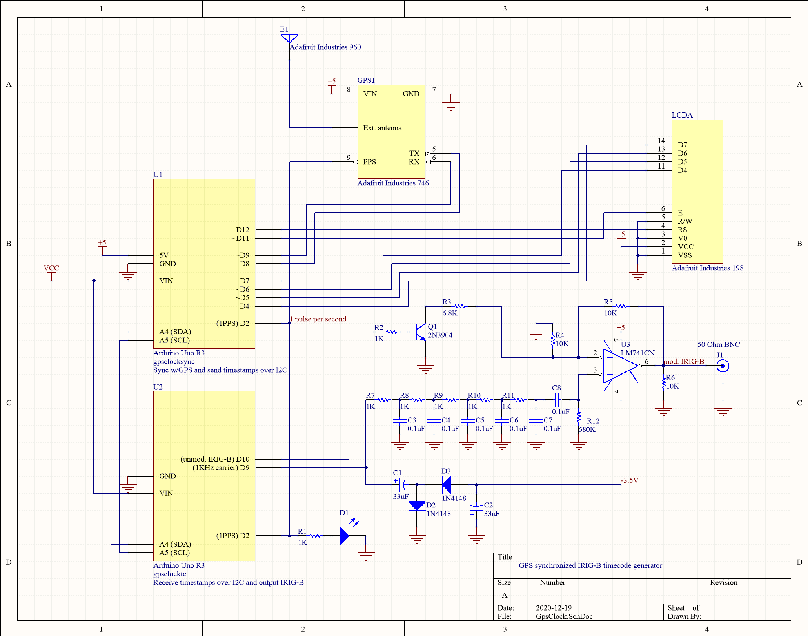

# gpsclock
An Arduino based IRIG-B time code generator suitable for use with a LED 
clock display.  A standard LCD can be connected since you'll invariably need 
to troubleshoot the IRIG-B signal.

I wrote this so I could use a timecode display [like this](https://prostudioconnection.com/products/symmetricom-820-210-rd-1-irig-b-serial-timecode-red-led-remote-display-rackmount-refurbished) 
I was lucky enough to find in a dumpster somewhere.

This uses two separate Arduinos since it's apparently too much to ask for 
one Arduino to read serial input from the GPS receiver while outputting 
an IRIG-B timecode.  The sketches:

* `gpsclocksync.ino` Sync w/GPS and send timestamps over I2C
* `gpsclocktc.ino` Receive timestamps over I2C and output IRIG-B

## Useful Resources

* [Adafruit GPS Library](https://github.com/adafruit/Adafruit_GPS):
  Read the example code!

* joshuaferrara's [IRIG-Arduino decoder](https://github.com/joshuaferrara/IRIG-Arduino) 
  to validate the IRIG-B signal you send

* Cyber Sciences [IRIG-B technical note](http://www.cyber-sciences.com/wp-content/uploads/2019/01/TN-102_IRIG-B.pdf) 
  which describes the IRIG-B signal more simply than anything else I found

* Meinberg [IRIG Time Code Formats](https://www.meinbergglobal.com/english/info/irig.htm)
  which goes into deep detail on the surprisingly diverse IRIG formats

* Wikipedia's [IRIG timecode](https://en.wikipedia.org/wiki/IRIG_timecode)
  article has a decent table breaking down each IRIG bit's meaning

## Prerequisites
* The [Arduino IDE](https://www.arduino.cc/en/Main/Software)

* [Adafruit GPS](https://github.com/adafruit/Adafruit_GPS) library

* [digitalwritefast](https://code.google.com/archive/p/digitalwritefast/) library

  *Note, this library is quite old.  You will have to modify it as follows:*
  ```
  Need to change #include "WProgram.h" to #include "Arduino.h"
  and #include <wiring.h> to #include <wiring_private.h>
  ```

## Bill of Materials
### Required
2 Arduino UNO compatible boards (I used a genuine 
[Arduino UNO R3](https://store.arduino.cc/usa/arduino-uno-rev3), 
and a [SparkFun RedBoard](https://www.sparkfun.com/products/13975))

1 [Adafruit Ultimate GPS Breakout](https://www.adafruit.com/product/746)

1 50 Ohm BNC Jack, e.g. [TE Connectivity 5227161-7](https://www.digikey.com/product-detail/en/te-connectivity-amp-connectors/5227161-7/A32260-ND/811158)

1 50 Ohm BNC Cable, e.g. [Steren Electronics 36" RG56/U](https://www.jameco.com/webapp/wcs/stores/servlet/ProductDisplay?langId=-1&storeId=10001&catalogId=10001&productId=11404)

7 1k 1/4 watt resistor

3 10k 1/4 watt resistor

1 6.8k 1/4 watt resistor

1 680k 1/4 watt resistor

6 0.1 uF ceramic capacitors

2 33uF 35V aluminum electrolytic capacitors

2 small signal diodes, e.g. 1N4148

1 small signal NPN transistor, e.g. 2N3904

1 LED

1 Breadboard, this will fit on an [Adafruit half-size breadboard](https://www.adafruit.com/product/64)

Wire

### Optional, but recommended
1 20x4 LCD, Hitachi HD44780 compatible.  I used an old Hantronix 
[HDM20416H](https://www.mouser.com/ProductDetail/Hantronix/HDM20416H-S00S?qs=NSR9MB9QqxYnIDs7uTmqSQ%3D%3D)

1 [external GPS antenna](https://www.adafruit.com/product/960) Place the 
antenna by a window: GPS doesn't work well indoors

1 [SMA to μFL adapter](https://www.adafruit.com/product/851) Required if 
using external antenna (above)

An oscilloscope or logic probe.  You can't troubleshoot this without one.  I 
used and recommend Diglent's 
[Analog Discovery 2](https://store.digilentinc.com/analog-discovery-2-100msps-usb-oscilloscope-logic-analyzer-and-variable-power-supply/).

## Hardware Setup
[](gpsclock_sch.png)  
[PDF version of schematic](gpsclock_sch.pdf)

My clock needs the IRIG-B time code signal modulated on a 1 KHz sine wave 
carrier.  To accomplish this, the `gpsclocktc` Arduino outputs a 1 KHz 
square wave on pin D9, which is low-pass filtered to look enough like a 
sine wave.  An op amp modulates the IRIG-B signal.  Since op amps need 
both positive and negative supply, I added a charge pump on the same 
1 KHz square wave.  It gives an asymmetrical +5V and -3.5V, but it works 
well enough.

Plug one of the Arduinos into a power supply.  Tie the Vin pins of both 
Arduinos together.  Use the regulated +5V supply from **only one** of the 
Arduinos as your +5V rail (GPS module, op amp, LCD).

## Troubleshooting
Use a spare Arduino to verify the GPS is working normally.  Follow the 
[instructions for the module](https://learn.adafruit.com/adafruit-ultimate-gps) 
over at Adafruit.  You should see NMEA sentences streaming from the unit, 
and they should make sense from a lat/long and time perspective.

Remember that it may take several minutes for the GPS receiver to get 
enough satellite fixes to send time data.  When you see the 1PPS LED 
flashing one per second, you have a fix.

Verify the IRIG-B signal looks decent from a scope.

Once the IRIG-B signal looks reasonable, I suggest connecting a second 
Arduino running joshuaferrara's [IRIG-Arduino decoder](https://github.com/joshuaferrara/IRIG-Arduino) 
to the IRIG-B output, to validate the signal.

Once you've connected 2 Arduinos to each other, it might not always work 
when they both start.  Startup timing in the sketches probably needs to 
be improved.  Hit the reset button on each Arduino, and they will usually 
recognize each other fine.

## Bonus notes: time display
My time display is a Datum 9520-2002.  I have not found good documentation 
for it.

### Timezone setting
The DIP switches in the back (SW2) are for setting the timezone:

| Switch number | Meaning |
|--------------:|:--------|
| 1 | Sign (0 is +, 1 is -) |
| 2 | +16h |
| 3 |  +8h |
| 4 |  +4h |
| 5 |  +2h |
| 6 |  +1h |
| 7 | +30m |
| 8 | NC?  |

Each on (up) switch adds together to set the timezone.  For example, if you 
wanted to display Pacific Daylight Time (UTC-7) you would turn on switches 
1, 4, 5, and 6:

```
12345678 <-- Switch number
±S8421½? <-- Switch meaning (Sign, 16h, 8h, 4h, 2h, 1h, 30m, NC?)
10011100 <-- Turn on these switches (minus sign, 4 + 2 + 1)
```

### Under the cover!
On the main circuit board, there's a 45x14 prototyping perfboard in the 
middle, complete with +5V and ground connections.  You could probably fit 
the whole GPS clock circuit on here with only the GPS antenna living outside.